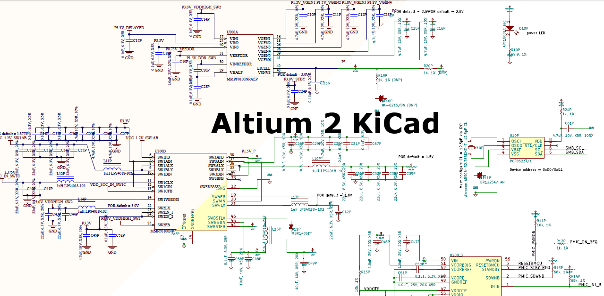

altium2kicad
============

Altium to KiCad converter for PCB and schematics

System requirements: Perl
Optionally: https://github.com/cbernardo/kicad_oce_vis or https://github.com/twlostow/step2wrl or FreeCAD

To convert your Altium project to KiCad:

This software is also provided as an online service: http://www2.futureware.at/KiCad/

To use it on your computer, install the git client (e.g. apt-get install git ) and download the software (e.g. git clone https://github.com/thesourcerer8/altium2kicad/ )
Go to the directory with your .PcbDoc and .SchDoc files and run:

* perl unpack.pl (it unpacks the .PcbDoc and .SchDoc files into subdirectores)
* If the Altium design contains 3D models in step format, run kicadd_oce_vis or step2wrl or FreeCAD to convert the files to wrl (with FreeCAD open and execute the macro step2wrl.FCMacro )
* perl convertschema.pl (it converts the schematics from the subdirectories to .sch and -cache.lib files)
* perl convertpcb.pl (it converts the PCB to .kicad_pcb files)

Due to the huge differences between Altium and KiCad, the weak fileformat documentation and the high complexity of the fileformats, this converter cannot guarantee the quality of the conversion. Please verify the output of the converter
If this converter does not work for your files, feel free to provide your files and screenshots of how they do look like and how they should look like, and I will try to help.

Current limitations of this converter:
* Design Rule Check settings are not converted

Currently known Limitations of KiCad:
* Bezier curves for component symbols -> WONTFIX -> Workaround with linearization
* Multi-line Text Frames
* A GND symbol with multiple horizontal lines arranged as a triangle
* Individual colors for single objects like lines, ...
* Ellipse
* Round Rectangle
* Elliptical Arc
* Rigid-Flex
* Octagonal pads not supported
* Arcs with a larger line thickness than the radius from Altium designs break the the VRML export
* STEP(STP) file support -> Will be fixed in the future, intermediate Workaround: Conversion with stp2wrl or FreeCAD

User Success Stories:
 * https://github.com/FPGAwars/icezum/wiki The Alhambra board was migrated to KiCad with this converter
